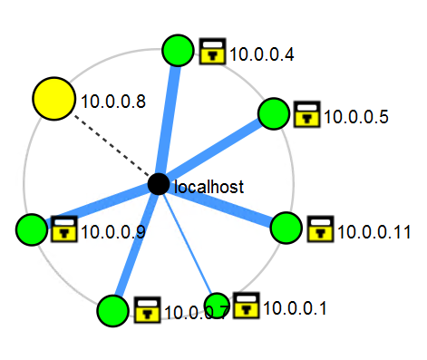
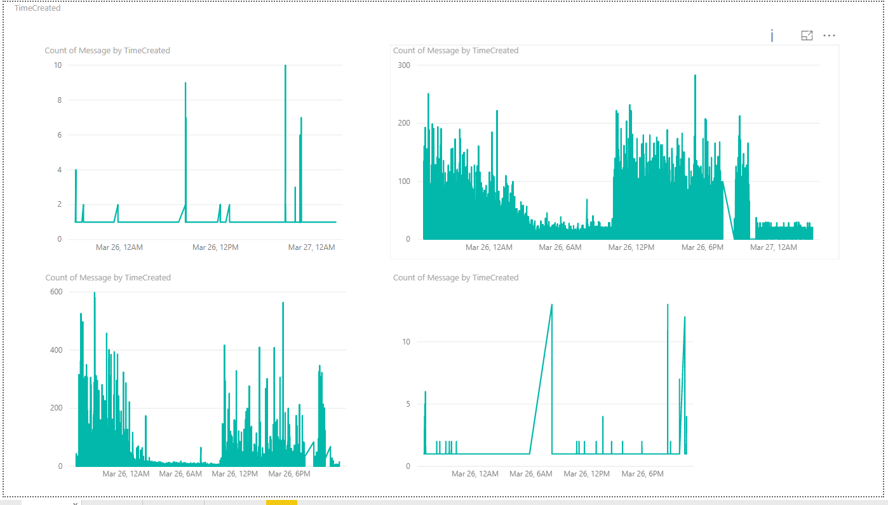
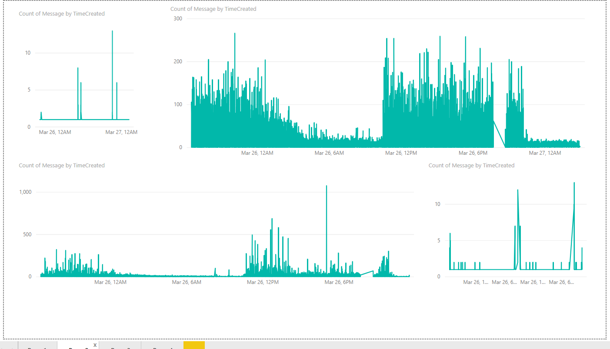
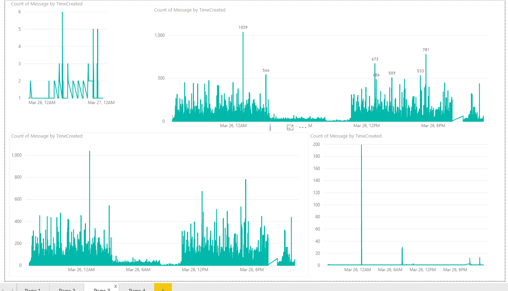
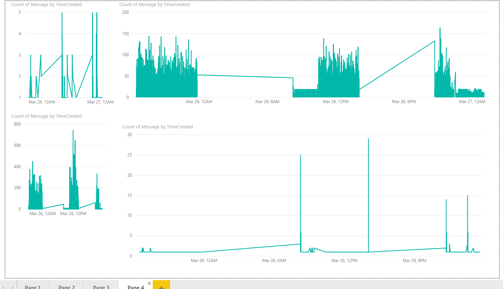

# Detekce anomálií v podnikové síti ŠKODA AUTO, a.s.
Existuje dokonalý IT zločin ? Dokážete se změnit z bezmocné oběti v úspěšného lovce ?
## Zadání
Cílem je vymyslet a popsat nové postupy pro detekci bezpečnostních událostí v podnikové infrastruktuře. 
## Zpracování - Monitoring sítě
Nejprve jsme provedli monitoring lokální sítě s příkazem **ipconfig** a **nmap**.
IP adresa serveru **je 10.0.0.8/24** a vychozi brany **10.0.0.1**.
```
nmap -sP 10.0.0.0/24
```
```
nmap -Pn --script vuln 10.0.0.0/24
```
Zjistili jsme, že lokální síť ve virtuálním prostředí odpovídá topologii korporátní sítě.
Na IP adresách **10.0.0.4, 10.0.0.5, 10.0.0.7, 10.0.0.9, 10.0.0.11** se pouze nachází služba odpovídající **ms-rdp**.



## Nástroj pro detekci útoků - MSFFinder
Nástroj [**MSFFinder.py**](MSFFinder.py) hledá výskyt slovního spojení **powershell.exe** a **hidden** v tabulce **sysmon.csv**. Toto spojení předchází binární payload, určený k exploitaci cíle. Taktéž můžeme, z defaultního chování nástroje Metasploit, hledat v logu string o velikosti 20 znaku s příponou **.exe** nebo **.temp** naznačující přítomnost útočníka.

## Zpracování - časová závislost zpráv jednotlivých stanic
> V pořadí: application.csv, security.csv, sysmon.csv, system.csv

PC1:

PC2:

PC5:

PC6


